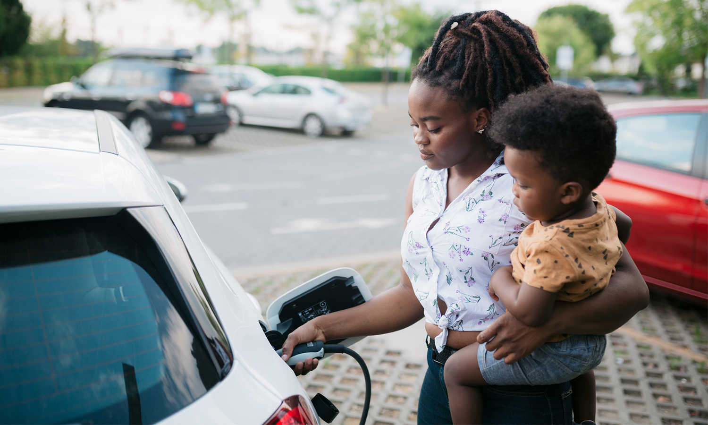
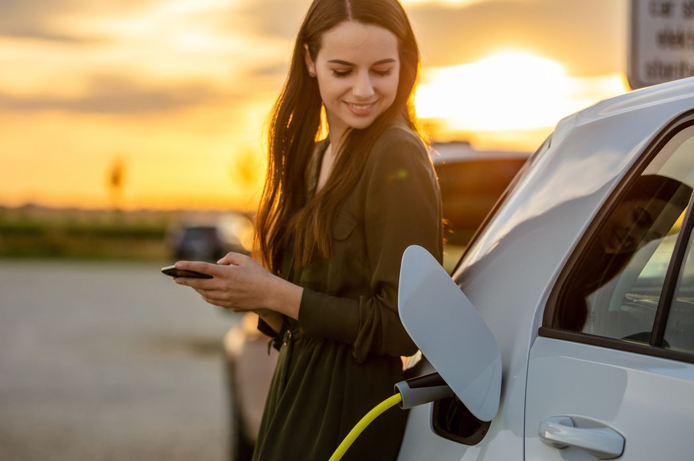
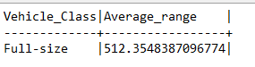
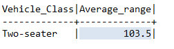
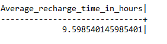
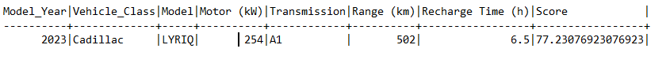
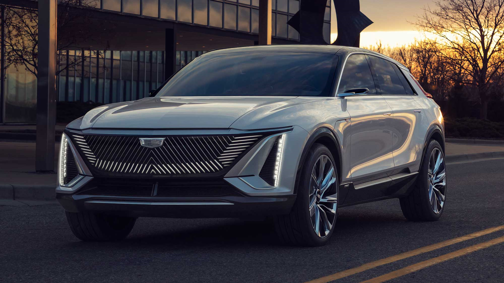
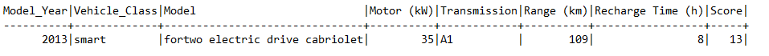
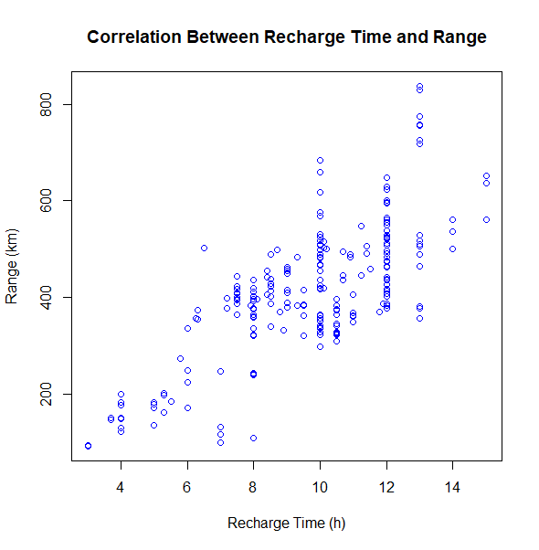
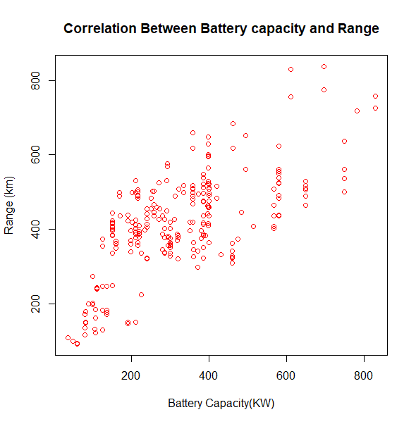

# Electric Vehicle Analysis

This project is an analysis of electric vehicles to identify trends and patterns in their characteristics, such as range and recharge time. 

The dataset used in this analysis contains information on vehicle make, model, class, motor power, transmission type, fuel type, range, recharge time, and consumption.

### Research Questions

#### The analys is aimed to answer the following research questions:

* What is the average range of electric vehicles by vehicle class?

* What is the average recharge time of electric vehicles?

* Which vehicle has the best range and recharge time combination?

* What is the correlation between recharge time and range for electric vehicles?

* What is the correlation between battery capacity and range for electric vehicles?

### Findings

#### The analysis revealed the following key findings:

* The average range of two-seater vehicles is the lowest at 103.5, while full-size vehicles have the highest average range at 512.4.

* The average recharge time for electric vehicles is 9.598, while the average range on a single charge is 394.462.

* Cardiac Lyric is the vehicle with the highest ranking in terms of recharge time and range, while the smart for two electric drive cabriolet has the lowest range in relation to recharge time.

* There is a strong positive correlation between recharge time and range for electric vehicles, with a correlation coefficient of 0.7670.

     

* There is also a strong positive correlation between battery capacity and range for electric vehicles, with a correlation coefficient of 0.7242.

    

### Conclusion

The analysis shows that there are significant differences in range and recharge time among electric vehicles, and that these differences are related to vehicle class, battery capacity, and transmission type. These findings can help consumers make informed decisions when purchasing electric vehicles, and can also inform manufacturers in their design and production processes.

#### Tools and Technologies

The analysis was performed using R programming language,SQL and Excel for data cleaning.

The dataset was obtained from [Canada open data repository](https://open.canada.ca/data/en/dataset/98f1a129-f628-4ce4-b24d-6f16bf24dd64#wb-auto-6)

#### Future Work

Future work could involve expanding the dataset to include more variables such as price, acceleration, and safety ratings, which could provide a more comprehensive analysis of electric vehicles. Additionally, further analysis could be done on specific vehicle models and their performance in relation to range and recharge time.

Thank you for taking the time to review my project! 🙂

Please feel free to contact me with any questions or feedback.
